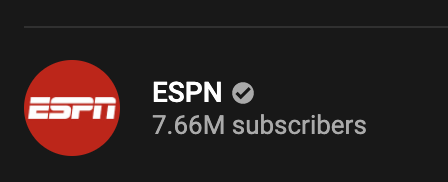

# YouTube Liker and Commenter - Python3 program

A program that Likes every video and comments on the latest 15 uploaded videos of a given Youtube Channel.

## API

This program interacts with the YouTube API, documentation found at https://developers.google.com/youtube/v3/docs

## Requirements

Need to create a project at https://console.developers.google.com/ to obtain authorization credentials in order to make API requests.

Get the Channel Id of the channel you want to like and comment on. To do this requires 3 steps

1. Go to your specified channel
2. Select any video from the Videos tab
   
3. Select the channel again in the description

   

4. Now the Channel Id will be in the URL
   
   ```
   The Channel Id is the last part of the URL, in this case
   ESPN's Channel Id is  UCiWLfSweyRNmLpgEHekhoAg
   ```

Replace "Desired-YouTube-Id" with your Channel Id wrapped in ""

```
71. videos_list = get_channel_videos("Desired-YouTube-Id")
```

Now create the list of comments you would like to use

```
comment_list = [
    "I love the content keep it up!!",
    "Very informational thank you!",
    "Amazing work!",
    "I love this!!",
    "Thank you clear explanation",
    "Awesome content keep it up!!",
    "Absolutely love the 5 minute length!",
    "This is very insightful, thanks for sharing",
    "Great job keep it up.",
    "I really enjoy these videos.",
]
```

### **All that's left is to run the program**
